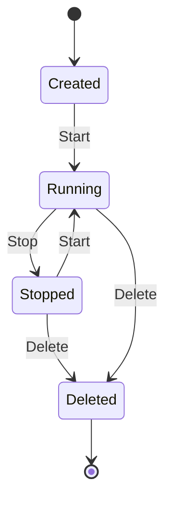

# repo7
テスト用のリポジトリ

## FastAPI Hello World API

このプロジェクトはFastAPIを使用したシンプルな **Hello World API** です。

### ディレクトリ構成
```
.
├── src/
│   ├── __init__.py
│   └── main.py          # FastAPIアプリケーション
├── tests/
│   ├── __init__.py
│   └── test_main.py     # pytest単体テスト
└── requirements.txt      # 依存関係
```

### セットアップ

依存関係をインストール:
```bash
pip install -r requirements.txt
```

### サーバーの起動

```bash
uvicorn src.main:app --reload
```

APIは http://localhost:8000 で利用可能になります。

### テストの実行

```bash
pytest tests/
```

### APIエンドポイント

- `GET /` - Hello Worldメッセージを返します
  - レスポンス: `{"message": "Hello World"}`

## 箇条書きのテスト

- aaa
- bbb
- ccc
  
## リンクのテスト

[GitHubのトップページ](https://github.com)

## Mermaidのテスト



## コードの表現

`README.md` を作る

```python
def foo()
  print("foo")
```

```sh
x=1
y=2
```

```java
class Animal {

}
```