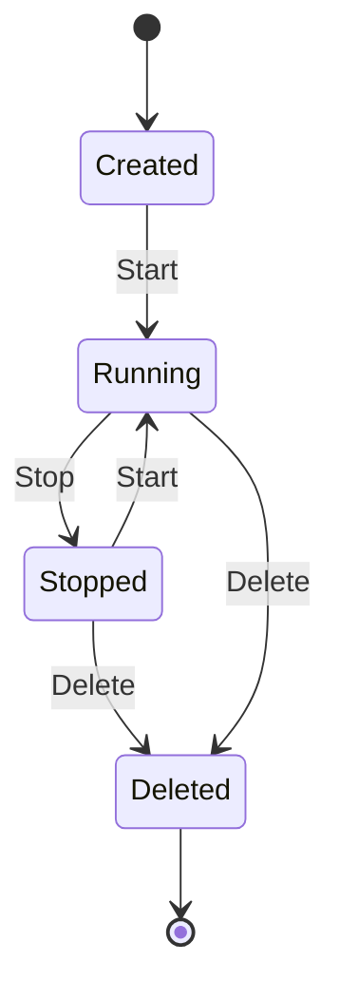

# repo7
Test repository

## FastAPI Hello World API

This project is a simple **Hello World API** using FastAPI.

### Directory Structure
```
.
├── src/
│   ├── __init__.py
│   └── main.py          # FastAPI application
├── tests/
│   ├── __init__.py
│   └── test_main.py     # pytest unit tests
└── requirements.txt      # Dependencies
```

### Setup

Install dependencies:
```bash
pip install -r requirements.txt
```

### Starting the Server

```bash
uvicorn src.main:app --reload
```

The API will be available at http://localhost:8000.

### Running Tests

```bash
pytest tests/
```

### API Endpoints

- `GET /` - Returns a Hello World message
  - Response: `{"message": "Hello World"}`

## Bullet Point Test

- aaa
- bbb
- ccc
  
## Link Test

[GitHub Top Page](https://github.com)

## Mermaid Test



## Code Representation

Create `README.md`

```python
def foo()
  print("foo")
```

```sh
x=1
y=2
```

```java
class Animal {

}
```